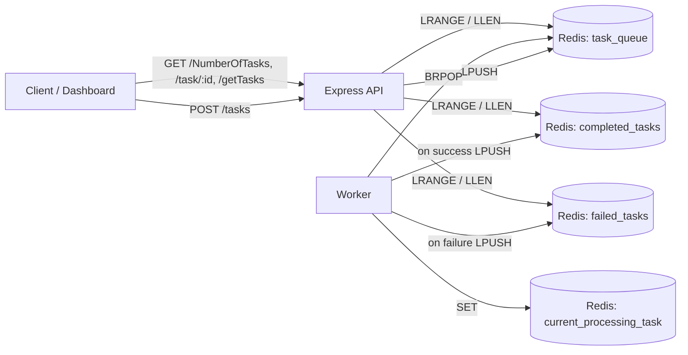

# Task Queue

A lightweight, production-minded task queue system built on Redis.

This project demonstrates a full async processing pipeline:

- API receives and validates incoming tasks
- Redis stores queued, completed, and failed jobs
- Worker consumes tasks in the background using a blocking pop loop
- React dashboard visualizes queue state in near real time

If you want a clean starter to learn queue architecture or demo background job execution, this repo is designed for that.

## Why This Project

Most queue tutorials stop at "push and pop". This project goes further by modeling the operational behavior you care about:

- task lifecycle states (`queued -> processing -> completed/failed`)
- observable in-flight work (`current_processing_task` in Redis)
- configurable processing delay to simulate real workloads
- configurable failure rate to test unhappy paths

## Feature Highlights

- Express API for task submission and querying
- Redis-backed queue and status lists
- Worker that continuously processes tasks with `BRPOP`
- Simulated latency and failure injection via env vars
- Frontend dashboard for counts and task visibility
- Clear JSON error responses for malformed request bodies

## Architecture



## Tech Stack

- Backend: Node.js, Express
- Data Layer: Redis
- Worker Runtime: Node.js + Redis client
- Frontend: React, Vite, Axios, Tailwind CSS

## Repository Layout

- `server.js`: API bootstrap, middleware, and JSON parse handling
- `api/routes.js`: task create/read endpoints
- `api/redisclient.js`: Redis queue primitives and lookup helpers
- `worker/worker.js`: task consumer, delay simulation, and fail/success routing
- `frontend_for_task_queue/`: monitoring dashboard

## Prerequisites

- Node.js 18+
- npm 9+
- Redis server (local, Docker, or managed)

## Quick Start

1. Install backend dependencies.

```bash
npm install
```

2. Install frontend dependencies.

```bash
npm --prefix ./frontend_for_task_queue install
```

3. Create environment files.

Windows:

```bash
copy .env.example .env
copy frontend_for_task_queue\.env.example frontend_for_task_queue\.env
```

macOS/Linux:

```bash
cp .env.example .env
cp frontend_for_task_queue/.env.example frontend_for_task_queue/.env
```

4. Start API server.

```bash
npm run dev
```

5. Start worker in a second terminal.

```bash
npm run worker
```

6. Start dashboard in a third terminal.

```bash
npm run frontend:dev
```

## Environment Configuration

Backend `.env`:

- `PORT`: API port (default: `3000`)
- `PROCESSING_DELAY_MS`: simulated worker delay per task in ms (default: `16000`)
- `FAILURE_RATE`: failure probability from `0` to `1` (default: `0.3`)

Frontend `frontend_for_task_queue/.env`:

- `VITE_BACKEND_URL`: backend base URL (default: `http://localhost:3000`)

## Worker Deep Dive: How Task Simulation Works

The worker logic lives in `worker/worker.js`, mainly inside `processTask`.

Lifecycle for each task:

1. `BRPOP task_queue` blocks until a task arrives.
2. Task status is set to `processing`.
3. Task is mirrored to `current_processing_task` so UIs can show active work.
4. Worker waits for `PROCESSING_DELAY_MS` using `setTimeout`.
5. Worker rolls random failure using `Math.random() < FAILURE_RATE`.
6. Success path pushes task into `completed_tasks`.
7. Failure path pushes task into `failed_tasks`.
8. `current_processing_task` is cleared.

This design intentionally simulates real async pipelines where work takes time and can fail, letting you demo resilience and observability without external infrastructure.

## Simulation Profiles (Ready-to-Use)

Fast local demo:

```env
PROCESSING_DELAY_MS=2000
FAILURE_RATE=0.1
```

Stress and failure demo:

```env
PROCESSING_DELAY_MS=5000
FAILURE_RATE=0.6
```

Nearly deterministic success:

```env
PROCESSING_DELAY_MS=1000
FAILURE_RATE=0
```

## API Reference

- `POST /tasks` -> enqueue a new task
- `GET /task/:id` -> fetch task details by id
- `GET /NumberOfTasks` -> queued/completed/failed/total counts
- `GET /getTasks` -> current queued task list

### Request Example

```http
POST /tasks
Content-Type: application/json
```

```json
{
	"task_type": "send_email",
	"payload": {
		"to": "user@example.com",
		"subject": "Welcome",
		"body": "Hello from Task Queue"
	}
}
```

### Example Success Response

```json
{
	"message": "Task created!",
	"task": {
		"task_id": "<uuid>",
		"task_type": "send_email",
		"payload": {
			"to": "user@example.com",
			"subject": "Welcome",
			"body": "Hello from Task Queue"
		},
		"created_at": "2026-03-30T00:00:00.000Z",
		"status": "queued"
	}
}
```

## Production Commands

- API: `npm start`
- Worker: `npm run worker:start`
- Frontend build: `npm run frontend:build`

## Troubleshooting

`Unexpected non-whitespace character after JSON` while creating a task:

- Cause: invalid JSON body (extra comma, stray characters, or two JSON objects merged)
- Fix: validate JSON and ensure `Content-Type: application/json`
- Behavior: API returns `400` with a clear error message

Worker exits immediately:

- confirm Redis is running and reachable
- verify env values are numeric (`PROCESSING_DELAY_MS`, `FAILURE_RATE`)
- run `npm run worker` after backend dependencies are installed

## GitHub Readiness Checklist

- `.gitignore` excludes `node_modules`, logs, and `.env`
- env templates are committed in `.env.example` files
- backend, worker, and frontend scripts are defined
- setup and troubleshooting are documented
- architecture and task lifecycle are explained

## Next Improvements

- add retry policy with exponential backoff for failed tasks
- add dead-letter queue for permanent failures
- add health/readiness endpoints
- add automated tests + GitHub Actions CI
